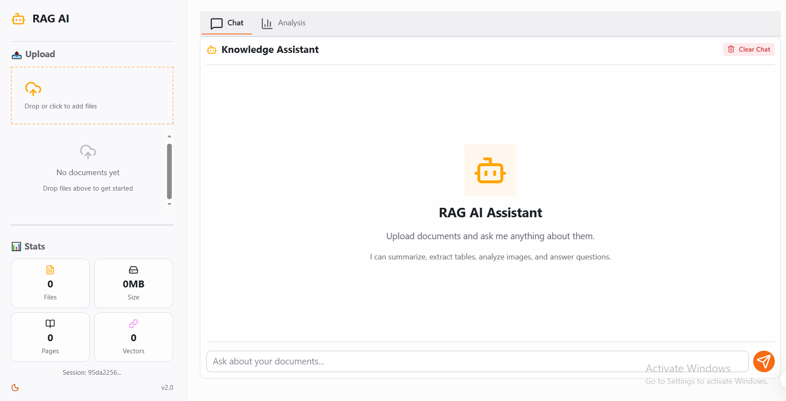

# Reflex-based RAG App with Docling

**Category:** AI & Agents
**Tech Stack:** Reflex, Docling, LangGraph, Google Gemini, Celery, Redis, Chroma
**Status:** Active
**Thumbnail:** assets/thumbnail.png

## Overview

A production-ready multi-user RAG application that processes PDFs, DOCX, PPTX, and HTML files using Docling for intelligent document parsing, then enables conversational Q&A with streaming responses and source citations. Built with Reflex for reactive UI, Celery+Redis for background document processing, and LangGraph for agent orchestration.

## Features

- **Multi-Format Support**: PDF, DOCX, PPTX, HTML
- **Intelligent Parsing**: Docling with OCR, table structure extraction, and image detection
- **Background Processing**: Celery workers with Redis broker for CPU-heavy document parsing
- **Per-Document Control**: Individual upload, process, stop, retry, and clear for each document
- **Streaming Chat**: Real-time token-by-token responses with source citations
- **Document Analysis**: Summary, hierarchy, tables, and image metadata tabs
- **Multi-User Isolation**: Each browser session gets its own vector store and agent
- **Smart Embedding**: Direct Google GenAI SDK integration with batch embedding and retry logic
- **Structured Logging**: JSON-formatted logs with structlog for production observability

## Screenshot



## Tech Stack

| Layer | Technology |
|-------|-----------|
| **Framework** | Reflex >= 0.8.24.post1 |
| **Document Parsing** | Docling [rapidocr] >=2.55.0 |
| **LLM Framework** | LangChain >=0.3.0, LangGraph >=0.2.0 |
| **LLM Provider** | Google Gemini (via `langchain-google-genai`) |
| **Embeddings** | Google `gemini-embedding-2-preview` (via `google-genai` SDK) |
| **Background Tasks** | Celery >=5.3.0 + Redis >=5.0.0 |
| **Vector Store** | ChromaDB (in-memory per session) |
| **Logging** | structlog with JSON output and rotating file handler |
| **Python** | >=3.12 |

## Setup

### 1. Environment Variables

Create a `.env` file in the project root:

```bash
# Required
GOOGLE_API_KEY=your-google-api-key

# Optional
GEMINI_MODEL=gemini-2.5-flash                        # LLM model selection
EMBEDDING_MODEL=gemini-embedding-2-preview           # Embedding model
EMBEDDING_BATCH_SIZE=100                             # Max texts per batch (Google limit)
EMBEDDING_RPM_LIMIT=5                                # Requests per minute (free tier: 5)
EMBEDDING_MAX_RETRIES=5                              # Retry attempts for rate-limited calls
HF_TOKEN=your-huggingface-token                      # For faster Docling model downloads
REDIS_URL=redis://localhost:6379/0                   # Redis broker URL
```

### 2. Install Dependencies

```bash
# Using UV (preferred)
uv sync

# Or using pip
pip install -r requirements.txt
```

### 3. Run the App

```bash
# Unified launcher: Redis + Celery worker + Reflex
bash start.sh

# Or run Reflex directly (Celery worker must be running separately)
reflex run
```

- Frontend: `http://localhost:3001`
- Backend API: `http://localhost:8002`
- Redis: `redis://localhost:6379`

### 4. GitHub Codespaces

The app is configured to run in GitHub Codespaces with polling transport (no WebSocket required):

```bash
# In Codespaces terminal
bash start.sh
```

The `start.sh` script automatically:
- Starts Redis server
- Applies Reflex polling transport patch
- Purges old Celery task metadata
- Starts Celery worker with model pre-warming
- Launches Reflex app

## Architecture

The project follows a strict three-layer architecture with background task processing:

### 1. Core (`RAG_app/core/`)
Pure Python modules with **no Reflex imports**.

| File | Purpose |
|------|---------|
| `document_processor.py` | Docling ingestion, batching, overlap |
| `embeddings.py` | GeminiEmbedder (direct Google GenAI SDK, bypasses LangChain bug #1704) |
| `vector_store.py` | Chunking, embedding, Chroma creation |
| `celery_app.py` | Celery configuration with Redis broker |
| `celery_tasks.py` | CPU-bound document processing tasks |
| `tools.py` | Agent search tool factory |
| `agent.py` | LangGraph agent factory |
| `structure.py` | Pre-serialization for Docling visualization |
| `session_registry.py` | Session-scoped object registry |
| `logging_config.py` | Structured logging with structlog |

### 2. State (`RAG_app/state/`)
Reflex `rx.State` classes holding **only serializable data**.

| File | Purpose |
|------|---------|
| `base_state.py` | `session_id`, theme, app initialization |
| `upload_state.py` | File ingestion orchestration with Celery polling |
| `chat_state.py` | Chat history & streaming |
| `structure_state.py` | Document visualization state |

### 3. UI (`RAG_app/components/`, `RAG_app/pages/`)
Reflex components with **zero business logic**.

| File | Purpose |
|------|---------|
| `layout.py` | Sidebar + main wrapper |
| `upload.py` | File upload, progress, staging |
| `chat.py` | Chat bubbles, input, streaming status |
| `structure.py` | Document analysis tabs |
| `dashboard.py` | Main page with tabs |

### Background Processing
CPU-bound Docling parsing runs in **Celery worker processes** (not the Reflex event loop) to prevent blocking all users.

Worker configuration:
- **Model pre-warming**: Docling models loaded at startup via `worker_ready` signal
- **Memory management**: `max_tasks_per_child=5` (restarts worker after 5 docs)
- **Rate limiting**: 2 tasks/minute globally via `task_default_rate_limit`
- **Task timeout**: 10 minutes hard limit, 8 minutes soft limit
- **Unified launcher**: `start.sh` handles Redis + Celery + Reflex

## Project Structure

```
RAG_app/
  core/
    __init__.py
    session_registry.py      # Session-scoped object registry
    document_processor.py    # Docling ingestion, batching, overlap
    embeddings.py            # GeminiEmbedder (bypasses LangChain bug #1704)
    vector_store.py          # Chunking, embedding, Chroma creation
    celery_app.py            # Celery configuration with Redis broker
    celery_tasks.py          # CPU-bound document processing tasks
    tools.py                 # Agent search tool factory
    agent.py                 # LangGraph agent factory
    structure.py             # Pre-serialization for Docling visualization
    logging_config.py        # Structured logging with structlog
  state/
    __init__.py
    base_state.py            # session_id, theme, app initialization
    upload_state.py          # File ingestion orchestration with Celery polling
    chat_state.py            # Chat history & streaming
    structure_state.py       # Document visualization state
  components/
    __init__.py
    layout.py                # Sidebar + main wrapper
    upload.py                # File upload, progress, staging
    chat.py                  # Chat bubbles, input, streaming status
    structure.py             # Document analysis tabs
  pages/
    __init__.py
    dashboard.py             # Main page with tabs
  RAG_app.py                 # App factory & page registration
assets/
  favicon.ico
  style.css
  thumbnail.png              # Project screenshot for portfolio
rxconfig.py
pyproject.toml
.env.example
start.sh                     # Unified launcher (Redis + Celery + Reflex)
patch_reflex_event.py        # Polling transport patch for Codespaces
```

## Testing Strategy

Manual end-to-end test required after every significant change:

1. Upload a PDF (or DOCX/PPTX/HTML).
2. Verify processing completes without errors.
3. Ask a question; verify streaming and citations.
4. Check Document Analysis tabs.
5. Open incognito window; verify sessions are isolated.

## Troubleshooting

| Issue | Solution |
|-------|----------|
| `ValueError: Exception information must include the exception type` | Stop the app, run `bash start.sh` (purges corrupted Celery metadata) |
| `429 RESOURCE_EXHAUSTED` on embedding | Google free tier quota (100 req/day) exhausted. Wait for midnight PT reset or use a different API key. |
| Worker killed (`SIGTERM`) | Document too large for current CPU/memory. Try processing smaller documents or increase Codespaces resources. |
| Documents stuck at "Processing" | Check Celery worker is running (`ps aux | grep celery`). Restart with `bash start.sh`. |

## License

MIT License

## References

- [LangChain Google GenAI Issue #1704](https://github.com/langchain-ai/langchain-google/issues/1704) — Batch embedding count mismatch
- [Docling Documentation](https://github.com/docling-project/docling)
- [Reflex Documentation](https://reflex.dev/docs)
